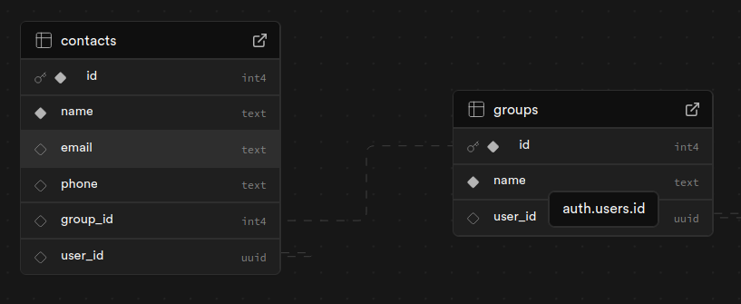
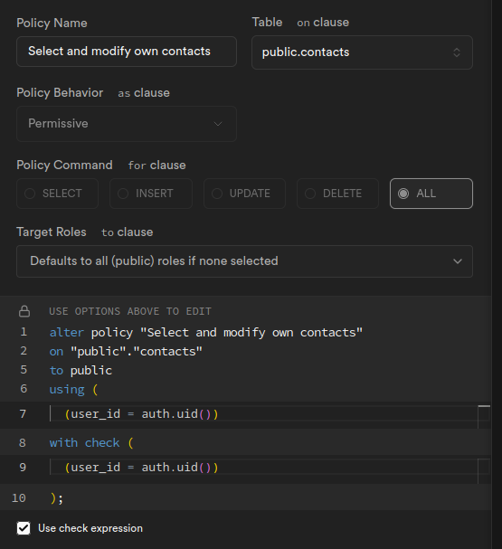

# Die Architektur



Man kann neue Kontakte erstellen, bearbeiten und löschen.
Man kann neue Gruppen erstellen und Kontakte hinzufügen.
Jeder Kontakt kann nur in einer Gruppe vorhanden sein.

```bash
src
├── App.css
├── App.jsx
├── assets
│   └── react.svg
├── components
│   ├── AddContactForm.jsx
│   ├── AddGroupForm.jsx
│   ├── ContactList.jsx
│   ├── Contacts.jsx
│   ├── GroupList.jsx
│   └── Groups.jsx
├── index.css
├── main.jsx
└── supabaseClient.js
```
