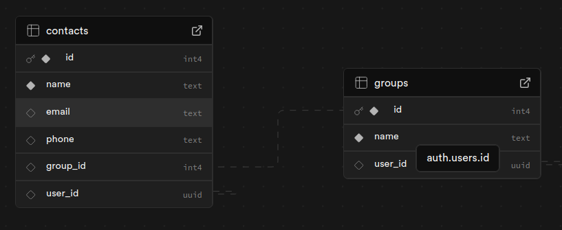

# How to use and deploy
---
## Before you start
Make sure you create a new project in [Supabase](https://supabase.com/).

Make sure you implement these tables and these Policiest:



---
## Step 0
```bash
git clone https://github.com/bomba-cat/Contacts.git
cd Contacts
```

## Step 1
Create a .env 

```bash
touch .env
```

file as follows:

```bash
VITE_API = ""
VITE_KEY = ""
```

## Step 2
Run with the very beautiful

```bash
npm i
npm run dev
```

commands

## Step 3
Now open up your shiny new `http://localhost:5173`
